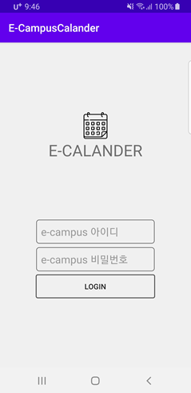
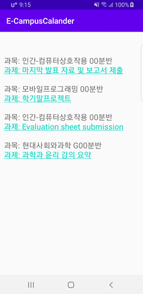

# Class Alarm

### GOAL

> 매일 해당 일자의 수업 일정을 크롤링하여 사용자에게 수업 전 노티 제공

### PROJECT

> python 폴더는 backend 크롤링 서버
>
> E_CampusCalander 폴더는 android sdk를 통하여 build하는 코드
>
> python으로 구성된 backend 서버에 ip주소를 andoid 코드에서 수정하여 사용

### RESULT

          

